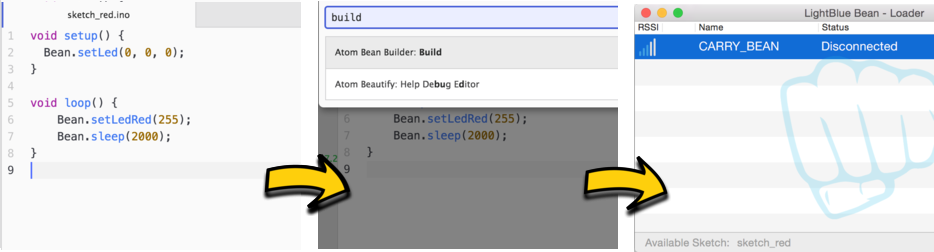

# "Bean Builder" for Atom Editor

**NOTE: This is not released yet, should be out by March 20th**

The "Bean Builder" is an [Atom](https://atom.io/) package that allows you to build Arduino sketches for the [LightBlue Bean](https://punchthrough.com/bean/) and upload them to the [Bean Loader application](https://punchthrough.com/bean/guides/getting-started/os-x/).

### Motivation

The LightBlue Bean ecosystem makes the barrier to entry for "embedded" development very low. In no time at all you can be writing sketches for the Bean using the Arduino IDE and the Bean Loader application. However, before long you may find yourself desiring a more rich editor/IDE such as Atom. Arduino allows you to do use external editors but it introduces yet another application to the mix because the Arduino IDE is still required for compiling sketches. This package eliminates the need for the Arduino IDE and lets you build sketches straight from Atom and sends the compiled sketch to the Bean Loader, just like Arduino does.

# Usage

Currently using this package is extremely easy because it only has a single function. These usage docs will expand as the "Features and Roadmap" backlog is implemented.

This package adds a command to the [Atom command palette](https://github.com/atom/command-palette) called **Bean Build**, which builds the the sketch that is **currently in focus** in the editor window. The steps can be broken into three:

1. Open desired sketch
2. Type "Bean Build" into the command palette (`cmd-shift-p`)
3. Observe that the sketch is "Available" in Bean Loader

# Features and Roadmap

Coming soon.
